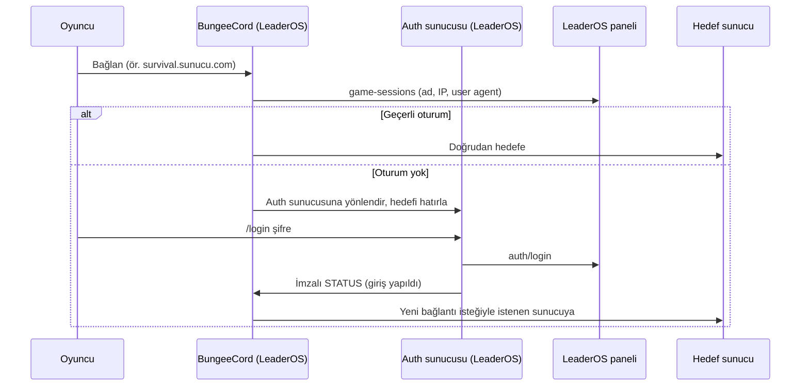

# LeaderOS Auth Plus — Wiki

LeaderOS Auth Plus, oyuncuların Minecraft sunucusunda LeaderOS paneli hesaplarıyla giriş yapmasını, kayıt olmasını ve iki adımlı doğrulamayı (2FA) tamamlamasını sağlar. Bu belge kurulum, ağ yapıları, tüm yapılandırma anahtarları, güvenlik modeli ve sorun giderme için başvuru kaynağıdır.

> Sürüm: **1.1.1-siberanka** · Platformlar: Bukkit / Spigot / Paper / Folia, BungeeCord (Waterfall dahil), Velocity (LimboAPI ile)

---

## İçindekiler

1. [Nasıl çalışır?](#1-nasıl-çalışır)
2. [Gereksinimler](#2-gereksinimler)
3. [Ağ yapısı seçimi](#3-ağ-yapısı-seçimi)
4. [Kurulum](#4-kurulum)
5. [Yapılandırma başvurusu](#5-yapılandırma-başvurusu)
6. [Komutlar ve izinler](#6-komutlar-ve-izinler)
7. [Oturumlar ve yeniden bağlanma](#7-oturumlar-ve-yeniden-bağlanma)
8. [Bedrock / Geyser / Floodgate](#8-bedrock--geyser--floodgate)
9. [twilight-proxy ile kullanım](#9-twilight-proxy-ile-kullanım)
10. [Güvenlik modeli](#10-güvenlik-modeli)
11. [Kayıt limiti ve yan hesap takibi](#11-kayıt-limiti-ve-yan-hesap-takibi)
12. [Veritabanı](#12-veritabanı)
13. [Yükseltme](#13-yükseltme)
14. [Sorun giderme](#14-sorun-giderme)
15. [Sık sorulan sorular](#15-sık-sorulan-sorular)
16. [Kaynaktan derleme](#16-kaynaktan-derleme)

---

## 1. Nasıl çalışır?

Eklenti şifreleri kendisi saklamaz; her karar LeaderOS panelinin API'sine sorulur:

| Panel isteği | Ne zaman | Sonuç |
|---|---|---|
| `auth/game-sessions` | Oyuncu bağlanırken | `REGISTER_REQUIRED`, `LOGIN_REQUIRED`, `HAS_SESSION` (geçerli oturum) veya `EMAIL_NOT_VERIFIED` |
| `auth/login` | `/login <şifre>` | Başarılı, 2FA gerekli, yanlış şifre veya kullanıcı yok |
| `auth/register` | `/register <şifre> <şifre/e-posta>` | Hesap oluşturulur, oturum açılır |
| `auth/tfa/verify` | `/tfa <kod>` | 2FA tamamlanır |

Panel oturumu **oyuncu adı + IP + kullanıcı ajanı (user agent)** ile tanır. `session: true` iken eklenti sabit bir kullanıcı ajanı kullanır; böylece aynı IP'den gelen oyuncu oturum süresi boyunca tekrar şifre girmez.

Doğrulanmamış oyuncu hareket edemez, sohbet edemez, eşyalarla etkileşemez ve yalnızca giriş/kayıt/2FA komutlarını kullanabilir. Süre (`auth-timeout`) dolarsa sunucudan atılır.

---

## 2. Gereksinimler

| Bileşen | Gereksinim |
|---|---|
| LeaderOS | Panel adresi ve **Dashboard > API** sayfasından alınan API anahtarı |
| Bukkit | Spigot / Paper / Folia, 1.13 ve üzeri önerilir (Java 8+; daha eski sürümler test edilmedi) |
| BungeeCord | Güncel BungeeCord veya Waterfall (Java 8+) |
| Velocity | Velocity 3.4+ veya 4.x ve **LimboAPI** (Velocity'nin istediği Java sürümü) |
| Bedrock (isteğe bağlı) | Geyser + Floodgate |
| Ağ güvenliği | Proxy kullanıyorsanız **BungeeGuard** veya **Velocity modern forwarding** (bkz. [Güvenlik modeli](#10-güvenlik-modeli)) |

---

## 3. Ağ yapısı seçimi

| Yapı | Hangi jar nereye | Giriş nerede olur |
|---|---|---|
| **A. Tek sunucu** | Bukkit jar → sunucu | Sunucunun kendisinde |
| **B. BungeeCord ağı** | Bukkit jar → **auth sunucusu**, BungeeCord jar → proxy | Auth sunucusunda (ör. `auth_lobby`) |
| **C. Velocity ağı** | Velocity jar + LimboAPI → proxy | Proxy'deki sanal "limbo" dünyasında; backend'lere eklenti gerekmez |

**B yapısında** diğer backend'lere (lobby, survival…) eklenti kurmanız gerekmez. Proxy, giriş yapmamış oyuncuyu her zaman auth sunucusunda tutar; auth sunucusu girişten sonra proxy'ye imzalı bir mesaj gönderir ve oyuncu serbest kalır.

**C yapısında** oyuncu proxy'ye girer girmez limbo'ya alınır; giriş tamamlanınca Velocity normal sunucu seçimine devam eder.



---

## 4. Kurulum

### A. Tek sunucu (Bukkit)

1. `leaderos-auth-bukkit-<sürüm>.jar` dosyasını `plugins/` klasörüne koyun.
2. Sunucuyu bir kez başlatıp durdurun.
3. `plugins/LeaderOS-Auth/config.yml` içinde `url` ve `api-key` alanlarını doldurun.
4. Sunucuyu başlatın. Konsolda hata olmamalı.

### B. BungeeCord ağı

1. **Auth sunucusu:** Bukkit jar'ını kurun; `spigot.yml` içinde `settings.bungeecord: true` olmalı.
2. **Proxy:** `leaderos-auth-bungee-<sürüm>.jar` dosyasını proxy'nin `plugins/` klasörüne koyun.
3. **BungeeGuard'ı** proxy'ye ve **tüm** backend'lere kurun (zorunlu güvenlik önlemi).
4. Proxy `plugins/LeaderOS-Auth/config.yml`:
   - `auth-server`: BungeeCord `config.yml` içindeki auth sunucusunun adı.
   - `url` ve `api-key`: auth sunucusundakiyle aynı (proxy tarafı oturum kontrolü için).
5. Auth sunucusunda giriş sonrası bir sunucuya göndermek istiyorsanız `send-after-auth` ayarlayın.
6. Backend portlarını güvenlik duvarıyla yalnızca proxy'ye açın.

İmzalama anahtarı BungeeGuard token'ından otomatik bulunur. BungeeGuard kullanamıyorsanız auth sunucusunda `proxy-messaging.secret` ve proxy'de `messaging.secret` alanlarına **aynı** 16+ karakterlik değeri yazın.

### C. Velocity ağı

1. `LimboAPI` ve `leaderos-auth-velocity-<sürüm>.jar` dosyalarını proxy'nin `plugins/` klasörüne koyun.
2. `velocity.toml` içinde `player-info-forwarding-mode = "modern"` kullanın ve backend'lerde (Paper `config/paper-global.yml` → `proxies.velocity`) aynı gizliyi tanımlayın.
3. `plugins/leaderosauth/config.yml` içinde `url` ve `api-key` alanlarını doldurun.
4. İsteğe bağlı: özel limbo dünyası için `custom-world` ayarlarını kullanın (WorldEdit `.schem` dosyası).

---

## 5. Yapılandırma başvurusu

Yapılandırma dosyaları ilk açılışta oluşturulur. Tanınmayan veya eski anahtarlar otomatik temizlenir; bozuk bir dosya `config.broken.yml` olarak yedeklenip varsayılanlarla yeniden oluşturulur. Güvenlik açısından hatalı değerler (ör. aralık dışı sayılar) güvenli aralığa çekilir ve konsola uyarı yazılır.

### 5.1 Bukkit — `plugins/LeaderOS-Auth/config.yml`

Tüm anahtarlar `settings:` altındadır.

#### Genel

| Anahtar | Varsayılan | Açıklama |
|---|---|---|
| `lang` | `en` | Dil dosyası: `en` veya `tr` (`lang/` klasörü) |
| `url` | `https://yourwebsite.com` | LeaderOS site adresi (`https://` kullanın) |
| `api-key` | `YOUR_API_KEY` | Panel API anahtarı — **paylaşmayın** |
| `debug-mode` | `ONLY_ERRORS` | `DISABLED`, `ENABLED`, `ONLY_ERRORS` |
| `session` | `true` | Panel oturumu geçerliyse şifresiz giriş |
| `force-survival-mode` | `false` | Girişte hayatta kalma moduna al |
| `kick-non-registered` | `false` | Kayıtsız oyuncuyu hemen at |
| `kick-on-wrong-password` | `true` | Yanlış şifrede at |
| `auth-timeout` | `60` | Giriş için verilen süre (saniye) |
| `command-cooldown` | `3` | Doğrulanmamış oyuncu için komut bekleme süresi (saniye) |
| `min-password-length` | `5` | En kısa şifre (en az 4 uygulanır; en uzun 32) |
| `max-join-per-ip` | `0` | IP başına eşzamanlı bağlantı (0 = kapalı; proxy arkasında proxy uygular) |
| `register-second-arg` | `PASSWORD_CONFIRM` | `/register` ikinci argümanı: `PASSWORD_CONFIRM` veya `EMAIL` |
| `show-title` | `true` | Başlık mesajlarını göster |
| `login-commands` | `login, log, l, giris, giriş, gir` | Giriş komutu takma adları |
| `register-commands` | `register, reg, kayit, kayıt, kaydol` | Kayıt komutu takma adları |
| `tfa-commands` | `tfa, 2fa` | 2FA komutu takma adları |
| `unsafe-passwords` | liste | Kabul edilmeyen şifreler |

#### Proxy ile ilgili

| Anahtar | Varsayılan | Açıklama |
|---|---|---|
| `send-after-auth.enabled` | `false` | Girişten sonra başka sunucuya gönder |
| `send-after-auth.server` | `lobby` | Gönderilecek sunucu. Proxy'de `return-to-requested-server` açıksa oyuncunun istediği sunucu önceliklidir; bu sunucu yedektir |
| `proxy-messaging.secret` | `""` | Proxy mesajlarını imzalayan ortak gizli (16+ karakter). Boşsa Paper Velocity gizlisi veya ilk BungeeGuard token'ı kullanılır |
| `authme-bridge.accept-proxy-login` | `false` | AuthMeBungee/AuthMeVelocity `perform.login` mesajını kabul et. **Yalnızca proxy arkasında** geçerlidir |

#### E-posta doğrulama ve spawn

| Anahtar | Varsayılan | Açıklama |
|---|---|---|
| `email-verification.kick-non-verified` | `false` | E-postası doğrulanmamış oyuncuyu at |
| `email-verification.kick-after-register` | `false` | Kayıttan sonra doğrulama için at |
| `spawn.force-teleport-on-join` | `true` | Her girişte spawn'a ışınla (kapalıysa yalnız ilk girişte) |
| `spawn.location` | `""` | `/leaderosauth setspawn` ile ayarlanır |

#### Boss bar

| Anahtar | Varsayılan | Açıklama |
|---|---|---|
| `boss-bar.enabled` | `false` | Kalan süreyi boss bar ile göster |
| `boss-bar.color` | `AUTO` | `AUTO` veya `PINK, BLUE, RED, GREEN, YELLOW, PURPLE, WHITE` |
| `boss-bar.style` | `PROGRESS` | `PROGRESS, NOTCHED_6, NOTCHED_10, NOTCHED_12, NOTCHED_20` |

#### Bedrock

| Anahtar | Varsayılan | Açıklama |
|---|---|---|
| `bedrock.enabled` | `true` | Bedrock oyuncularına giriş/kayıt/2FA formları |
| `bedrock.form-delay` | `40` | İlk form gecikmesi (tick; 20 tick = 1 sn) |
| `bedrock.trust-xbox` | `false` | Xbox (XUID) bağıyla şifresiz giriş — bkz. [bölüm 8](#8-bedrock--geyser--floodgate) |
| `bedrock.trust-max-age-days` | `30` | Bağın son şifreli girişten sonra geçerli kaldığı gün (1–365) |

#### Kayıt limiti, yan hesap ve Discord

| Anahtar | Varsayılan | Açıklama |
|---|---|---|
| `register-limit.enabled` | `true` | IP ağı başına kayıt limiti |
| `register-limit.max-accounts-per-ip` | `3` | Ağ başına en fazla hesap |
| `register-limit.ipv6-prefix-length` | `64` | IPv6 gruplama öneki (48–64) |
| `register-limit.reservation-timeout-seconds` | `600` | Süren kaydın slotu tutma süresi (120–3600) |
| `alt-tracker.enabled` | `true` | Yan hesap bildirimleri |
| `discord.enabled` | `true` | Discord webhook bildirimi |
| `discord.webhook-url` | `""` | Webhook adresi — **paylaşmayın** |
| `discord.avatar-url` | Minotar adresi | `{player}` kullanılabilir |
| `discord.embed-thumbnail-url` | `""` | İsteğe bağlı küçük resim |
| `discord.embed-color` | `16711680` | Ondalık renk |
| `discord.debug` | `false` | Webhook yanıtlarını logla |

#### Veritabanı

| Anahtar | Varsayılan | Açıklama |
|---|---|---|
| `database.type` | `SQLITE` | `SQLITE` veya `MYSQL` |
| `database.expiration-time` | `60` | Bildirim geçmişi kaç gün tutulur (0 = süresiz). Güvenlik grafiği bundan etkilenmez |
| `database.mysql-hostname` / `mysql-port` / `mysql-database` | `localhost` / `3306` / `minecraft` | MySQL bağlantısı |
| `database.mysql-username` / `mysql-password` | `root` / `""` | MySQL kullanıcısı — **paylaşmayın** |
| `database.jdbcurl-properties` | `?useSSL=false&autoReconnect=true` | Ek JDBC parametreleri |
| `database.prefix` | `leaderos_auth_` | Tablo öneki (`[A-Za-z0-9_]`, en fazla 32) |
| `database.debug` | `false` | SQL ifadelerini logla |
| `database.placeholder-enabled` | `true` | PlaceholderAPI desteği |
| `database.placeholder-separator` | `, ` | Placeholder ayracı |

### 5.2 BungeeCord — `plugins/LeaderOS-Auth/config.yml`

| Anahtar | Varsayılan | Açıklama |
|---|---|---|
| `debug-mode` | `ONLY_ERRORS` | Hata ayıklama seviyesi |
| `auth-server` | `auth_lobby` | Giriş yapılan sunucunun BungeeCord'daki adı |
| `url` / `api-key` | örnek değerler | Proxy tarafı oturum kontrolü için; auth sunucusuyla aynı |
| `session` | `true` | Proxy'ye girişte panel oturumunu sor; geçerliyse auth sunucusunu atla |
| `session-check-timeout-millis` | `3000` | Panel cevabı için bekleme (500–5000 ms); aşılırsa auth sunucusu kullanılır |
| `return-to-requested-server` | `true` | Girişten sonra oyuncuyu istediği sunucuya döndür |
| `requested-server-ttl-seconds` | `600` | İstenen sunucunun hatırlanma süresi (30–3600) |
| `messaging.secret` | `""` | Ortak gizli; boşsa BungeeGuard token'ı |
| `messaging.require-signature` | `true` | İmzasız mesajları reddet. **Açık bırakın** |
| `bedrock.trust-xbox` | `false` | Bağlı XUID'li Bedrock oyuncusu auth sunucusunu atlar (Floodgate + MySQL gerekir) |
| `bedrock.trust-max-age-days` | `30` | Auth sunucusuyla aynı olmalı |
| `bedrock.database.*` | MySQL varsayılanları | Auth sunucusuyla **aynı** MySQL veritabanı ve önek |
| `allowed-commands` | giriş/kayıt/2FA komutları | Doğrulanmamış oyuncunun kullanabileceği komutlar |
| `hide-tab-complete` | `true` | Doğrulanmamış oyuncuya komut önerilerini gizle |
| `tab-complete-allowed-commands` | liste | Gizlemede görünecek komutlar |
| `max-join-per-ip` | `0` | IP başına eşzamanlı bağlantı |
| `kick-max-connections-per-ip` | mesaj | Limit aşım mesajı |

### 5.3 Velocity — `plugins/leaderosauth/config.yml`

Bukkit ile ortak anahtarlar (`lang`, `url`, `api-key`, `debug-mode`, `session`, `kick-non-registered`, `kick-on-wrong-password`, `auth-timeout`, `command-cooldown`, `min-password-length`, `register-second-arg`, `max-join-per-ip`, `email-verification.*`, `show-title`, `boss-bar.*`, `*-commands`, `discord.*`, `register-limit.*`, `database.*`, `alt-tracker.enabled`, `unsafe-passwords`) aynı anlama gelir. Velocity'ye özel olanlar:

| Anahtar | Varsayılan | Açıklama |
|---|---|---|
| `messaging.secret` | `""` | Backend'de LeaderOS çalışıyorsa ortak gizli; boşsa Velocity forwarding gizlisi |
| `bedrock.forms` | `true` | Limbo'da Bedrock formları (Floodgate gerekir) |
| `bedrock.form-delay-millis` | `2000` | İlk form gecikmesi (ms) |
| `bedrock.trust-xbox` | `false` | Xbox (XUID) bağıyla şifresiz giriş |
| `bedrock.trust-max-age-days` | `30` | Bağın geçerlilik süresi (gün) |
| `custom-world.enabled` | `false` | Limbo için özel dünya |
| `custom-world.file` | `world.schem` | `plugins/leaderosauth/` içindeki şematik |
| `custom-world.world-ticks` | `1000` | Dünya saati |
| `custom-world.light-level` | `15` | Işık seviyesi (0–15) |
| `custom-world.spawn-location.*` | `0` | Doğma noktası (`x, y, z, yaw, pitch`) |

> `register-limit.enabled: true` iken veritabanı başlatılamazsa Velocity eklentisi güvenlik gereği başlamaz.

### 5.4 Dil dosyaları

Bukkit ve Velocity'de tüm mesajlar `lang/en.yml` ve `lang/tr.yml` dosyalarındadır. `{prefix}`, `{seconds}`, `{min}`, `{max}`, `{player}` gibi yer tutucular desteklenir. Renk kodları `&` ve `#RRGGBB` biçimindedir.

---

## 6. Komutlar ve izinler

### Oyuncu komutları

| Komut | Açıklama |
|---|---|
| `/login <şifre>` | Giriş |
| `/register <şifre> <şifre>` veya `/register <şifre> <e-posta>` | Kayıt (`register-second-arg` ayarına göre) |
| `/tfa <kod>` | İki adımlı doğrulama kodu (6 hane) |

Takma adlar yapılandırmadaki `*-commands` listelerinden gelir.

### Yönetici komutları

| Komut | Platform | İzin | Açıklama |
|---|---|---|---|
| `/leaderosauth reload` | Bukkit | `leaderos.reload` | Yapılandırma ve dil dosyalarını, imzalama gizlisini yeniler |
| `/leaderosauth reload` | Velocity | `leaderosauth.reload` | Yapılandırma, dil, veritabanı ve gizliyi yeniler |
| `/leaderosauth setspawn` | Bukkit | `leaderos.setspawn` | Auth spawn noktasını bulunduğunuz yer yapar |
| `/leaderosauth unlinkbedrock <oyuncu>` | Bukkit, Velocity | `leaderos.bedrock.unlink` | Hesabın Xbox (XUID) bağını kaldırır |
| `/alt [oyuncu]` | Bukkit | `leaderos.auth.alt` | Bilinen yan hesapları listeler |
| `/alt delete <oyuncu>` | Bukkit | `leaderos.auth.alt.delete` | Oyuncunun yan hesap kayıtlarını siler |

### Diğer izinler (Bukkit)

| İzin | Açıklama |
|---|---|
| `leaderos.auth.alt.notify` | Yan hesap girişlerinde bildirim alır |
| `leaderos.auth.alt.notify.seevanished` | Görünmez oyuncuların bildirimlerini de görür |
| `leaderos.auth.alt.exempt` | Bildirimlerden muaf tutulur (güvenlik grafiğine yine yazılır) |

### PlaceholderAPI (Bukkit)

| Placeholder | Değer |
|---|---|
| `%leaderosauth_altdetector_alts_<oyuncu>%` | Oyuncunun bilinen yan hesapları (`placeholder-separator` ile ayrılmış) |

---

## 7. Oturumlar ve yeniden bağlanma

### Panel oturumu

`session: true` iken panel, aynı ad + IP + kullanıcı ajanıyla gelen oyuncuya `HAS_SESSION` döner ve oyuncu şifre girmeden girer. Oturumun ömrünü panel belirler.

### Proxy tarafı oturum kontrolü (BungeeCord)

Oyuncu proxy'ye girerken proxy, auth sunucusunun soracağı aynı soruyu panele sorar. Cevap `HAS_SESSION` ise oyuncu ilk sunucusu seçilmeden "giriş yapmış" işaretlenir ve auth sunucusuna hiç uğramaz. Panel hata verir veya `session-check-timeout-millis` aşılırsa her zamanki akış (auth sunucusu) uygulanır. Bu özellik için proxy'de `url` ve `api-key` dolu olmalıdır.

### İstenen sunucuya dönüş

Giriş yapmamış oyuncu auth sunucusuna çevrilirken, gitmek istediği sunucu (forced host, başka bir eklentinin yönlendirmesi) 10 dakika hatırlanır. Proxy'nin varsayılan sunucusu oyuncunun tercihi sayılmadığından hatırlanmaz.

Giriş başarılı olunca oyuncu bu sunucuya **yeni bir bağlantı isteğiyle** gönderilir; diğer eklentilerin izin kontrolleri yeniden çalışır. Sunucu yoksa, kısıtlıysa veya bağlantı başarısız olursa `send-after-auth` sunucusu yedek olarak kullanılır. Auth sunucusunun hemen ardından gönderdiği `send-after-auth` isteği, devam eden dönüşü bozmaz.

### Hızlı yeniden bağlanma

Eski bağlantı sunucu listesinden düşmeden aynı oyuncu yeniden bağlanırsa:

- **Aynı UUID ve aynı IP** → sunucu eski bağlantıyı düşürür, yenisi kendi oturumuyla devam eder ve ayrıca doğrulanır.
- **Farklı IP veya farklı UUID** → "zaten bağlısınız" ile reddedilir; çevrimiçi oyuncu düşürülmez.

### Velocity limbo akışı

Oturumu geçerli olan veya Xbox güveniyle tanınan oyuncu limbo'dan anında geçer. Diğerleri limbo'da giriş yapar; giriş tamamlanınca bağlantı "giriş yapmış" işaretlenir ve Velocity ilk sunucuyu normal şekilde seçer.

---

## 8. Bedrock / Geyser / Floodgate

### Formlar

Floodgate kuruluysa Bedrock oyuncuları komut yazmak yerine giriş, kayıt ve 2FA formları görür:

- **Bukkit:** Floodgate API'si ile (`bedrock.enabled`, `bedrock.form-delay`).
- **Velocity:** auth limbosunda (`bedrock.forms`, `bedrock.form-delay-millis`). Limbo'daki oyuncu henüz Velocity'ye kayıtlı olmadığından eklenti Floodgate'in form biçimini doğrudan kullanır; yalnızca beklenen formun cevabını bir kez kabul eder.

Kapatılan veya hatalı doldurulan form kısa bir beklemeden sonra yeniden gösterilir.

### Xbox (XUID) güveni — isteğe bağlı

`bedrock.trust-xbox: true` ile:

1. Floodgate oyuncusu **şifresiyle (ve gerekiyorsa 2FA ile) giriş yaptığında veya kayıt olduğunda** hesap, Floodgate'in doğruladığı XUID'ye bağlanır.
2. Sonraki girişlerde aynı XUID'ye sahip Floodgate oyuncusu şifre girmeden girer.
3. Karar **asla isim önekine (`.`) bakılarak verilmez**; kimlik her zaman Floodgate API'sinden okunur. Aynı isimle gelen Java oyuncusu veya başka bir Xbox hesabı güvenilmez.
4. Bir hesap ilk bağını korur. Başka bir Xbox hesabı şifreyle girse bile bağı devralamaz; konsola uyarı yazılır.
5. Bağ, son şifreli girişten sonra `trust-max-age-days` gün geçerlidir; şifresiz girişler süreyi uzatmaz.
6. `/leaderosauth unlinkbedrock <oyuncu>` bağı kaldırır (Xbox hesabı değiştiğinde veya şifre sızdığında).

> **Önemli:** Güvenilen girişte 2FA istemi de atlanır; Xbox Live oturumu faktör sayılır. Bu özellik yalnızca Geyser'de `validate-bedrock-login: true` iken güvenlidir — XUID'yi güvenilir yapan budur.

**BungeeCord'da** proxy de aynı kontrolü yapıp auth sunucusunu tamamen atlatabilir. Bunun için proxy'ye Floodgate kurulmalı ve bağlar auth sunucusuyla **paylaşılan MySQL** veritabanından okunmalıdır (`bedrock.database.*`, aynı `prefix`). Veritabanı ayarlanmazsa güvenilen giriş auth sunucusunda anında gerçekleşir; oyuncu yalnızca kısa bir an auth sunucusunda görünür.

### Floodgate verisinin backend'lere iletilmesi

Proxy'deki Floodgate'te `send-floodgate-data: true` ise Floodgate **tüm** backend'lere aynı `key.pem` ile kurulmalıdır. Aksi hâlde Floodgate'siz backend'ler bağlantıyı reddeder veya zaman aşımına düşer.

---

## 9. twilight-proxy ile kullanım

twilight-proxy, Bedrock oyuncusunu farklı kaynak paketi gerektiren bir sunucuya geçerken yeniden bağlar. LeaderOS Auth Plus bu yeniden bağlanmayı şöyle karşılar:

- **Oturum geçerliyse** oyuncu auth sunucusuna/limbo'ya uğramadan twilight-proxy'nin yönlendirdiği sunucuya gider.
- **Oturum yoksa** oyuncu auth sunucusunda giriş yapar ve ardından twilight-proxy'nin yönlendirdiği sunucuya döner. Yönlendirme kararı twilight-proxy'den **sonra** (BungeeCord'da öncelik 127) okunduğu için hedef kaybolmaz.
- **Velocity'de** giriş limbo'da, ilk sunucu seçiminden önce tamamlandığından twilight-proxy'nin ilk sunucu yönlendirmesi olduğu gibi çalışır.

Önerilen ayarlar:

| Yer | Ayar |
|---|---|
| Auth sunucusu / Velocity | `session: true` |
| BungeeCord (LeaderOS) | `return-to-requested-server: true` (varsayılan) |
| twilight-proxy | `login-servers` listesine auth sunucusunu ekleyin |
| Geyser | `validate-bedrock-login: true` |
| Velocity | `login-ratelimit` 3000 ms veya altı |
| Floodgate | `send-floodgate-data: true` ise tüm backend'lerde Floodgate + aynı `key.pem` |

---

## 10. Güvenlik modeli

### İmzalı proxy mesajları

Auth sunucusu ile proxy arasındaki giriş durumu (`STATUS`) ve yönlendirme (`CONNECT`) mesajları `leaderos:auth` kanalından gider ve şunları taşır:

- HMAC-SHA256 imzası (anahtar ortak gizliden türetilir),
- zaman damgası (±60 saniye kabul),
- tek kullanımlık rastgele nonce (tekrar oynatma koruması).

İmzasız, sahte, süresi geçmiş, tekrar gönderilmiş veya taşındığı bağlantıdaki oyuncudan başka bir oyuncu adına yazılmış mesajlar reddedilir ve debug modunda loglanır. Proxy bu kanalı iki yönde de tüketir: istemciler mesajları okuyamaz ve backend'e gönderemez.

Gizli şu sırayla bulunur:

| Taraf | Sıra |
|---|---|
| Bukkit | `proxy-messaging.secret` → Paper `proxies.velocity.secret` → eski `paper.yml` Velocity gizlisi → ilk BungeeGuard `allowed-tokens` değeri |
| BungeeCord | `messaging.secret` → `plugins/BungeeGuard/token.yml` |
| Velocity | `messaging.secret` → `forwarding.secret` (modern/BungeeGuard forwarding) |

16 karakterden kısa gizliler yok sayılır.

### Proxy'yi atlatma (doğrudan backend bağlantısı)

BungeeCord IP forwarding **BungeeGuard olmadan** veya Velocity `legacy`/`none` forwarding kullanılıyorsa, backend portuna doğrudan ulaşan herkes istediği isim, UUID ve IP ile girip auth sunucusunu atlayabilir. **Bu açığı hiçbir eklenti tek başına kapatamaz.** Çözüm:

1. BungeeGuard veya Velocity `modern` forwarding kullanın.
2. Backend portlarına yalnızca proxy'nin erişmesine izin verin (güvenlik duvarı veya yerel adrese bağlama).

Eklenti bu güvensiz yapıyı açılışta tespit edip konsola hata yazar (bkz. [Sorun giderme](#14-sorun-giderme)).

### AuthMe köprüsü

Eklenti AuthMe API'sini sağlar (`provides: AuthMe`); AuthMe'ye bağımlı eklentiler çalışmaya devam eder. AuthMeBungee/AuthMeVelocity'nin `perform.login` mesajı oyuncuyu şifresiz giriş yaptırdığı için yalnızca `authme-bridge.accept-proxy-login: true` iken **ve** sunucu proxy arkasındayken kabul edilir. Proxy'siz bir sunucuda bu mesajı herhangi bir istemci gönderebilir.

### Diğer önlemler

- Doğrulanmamış oyuncu için hareket, sohbet, komut, blok, envanter, eşya atma/değiştirme ve etkileşim engellenir.
- Giriş, kayıt ve 2FA komutları Bukkit konsol loglarından gizlenir (şifre sızıntısını önler).
- Proxy'de "giriş yapmış" durumu isme değil bağlantının kendisine bağlıdır; aynı isimle gelen başka bir bağlantıya geçemez.
- IP limiti çevrimiçi oyuncuları anlık sayar ve yalnızca süren girişleri izler; başarısız girişler slot tutmaz, sunucu geçişleri çift sayılmaz.

### Bilinen sınırlar

- **Panel IP oturumları:** Offline-mode sunucuda aynı IP'yi paylaşan biri (aynı ev, CGNAT, internet kafe) aynı isimle girerse açık panel oturumunu kullanabilir. Bu panel oturum modelinin doğası gereğidir. Online-mode, kısa oturum süresi veya `session: false` riski azaltır.
- **Xbox güveni** açıksa güvenilen Bedrock girişinde 2FA atlanır.
- **Ortak gizli** sızarsa, aynı gizli genellikle forwarding'i de koruduğundan saldırgan zaten proxy kimliğine bürünebilir. Gizliyi yalnızca sunucularda tutun, depoya veya ekran görüntüsüne koymayın.

---

## 11. Kayıt limiti ve yan hesap takibi

- Kayıt hakkı panel isteğinden **önce**, veritabanında tek bir işlem (transaction) içinde ayrılır; aynı anda gönderilen kayıtlar limiti aşamaz.
- Limit yalnızca o anki IP'yi değil, ortak IP kullanmış tüm hesap–IP ağını sayar. IPv6 adresleri `ipv6-prefix-length` önekine göre gruplanır; adres değiştirmek limiti sıfırlamaz.
- Başarılı her giriş güvenlik grafiğine yazılır; bu kayıt Discord bildirimi, muafiyet izni ve `expiration-time` ayarından bağımsızdır.
- Veritabanı hatasında kayıt **reddedilir** (fail-closed).
- Yan hesap bulunduğunda `leaderos.auth.alt.notify` izinli yetkililere ve (açıksa) Discord'a bildirim gider.

---

## 12. Veritabanı

| Platform | Varsayılan | Konum |
|---|---|---|
| Bukkit | SQLite | `plugins/LeaderOS-Auth/altdetector.db` |
| Velocity | SQLite | `plugins/leaderosauth/altdetector.db` |
| BungeeCord | — | Yalnızca Xbox güveni için MySQL (auth sunucusuyla paylaşılan) |

Önemli tablolar (`prefix` ile başlar):

| Tablo | İçerik |
|---|---|
| `registration_accounts_v2`, `registration_links_v2`, `registration_reservations_v2` | Kayıt limiti ve hesap–IP grafiği |
| `bedrock_links_v1` | Hesap → XUID bağları |
| `playertable`, `iptable` | Yan hesap bildirim geçmişi |

Eski sürümlerin tabloları ilk açılışta otomatik ve tekrar çalıştırılabilir biçimde yeni şemaya aktarılır. Birden çok sunucu aynı verileri kullanacaksa MySQL tercih edin.

---

## 13. Yükseltme

### 1.0.x → 1.1.x

1. Auth sunucusundaki Bukkit jar'ını ve proxy jar'ını **birlikte** güncelleyin; proxy mesaj protokolü değişti.
2. BungeeGuard veya Velocity modern forwarding kullanıyorsanız gizli otomatik bulunur. Kullanmıyorsanız `proxy-messaging.secret` (auth sunucusu) ve `messaging.secret` (proxy) alanlarına aynı değeri yazın.
3. Geçiş sırasında eski backend'leri geçici olarak kabul etmek için BungeeCord'da `messaging.require-signature: false` kullanılabilir. **Geçiş bitince `true` yapın.**
4. AuthMeBungee/AuthMeVelocity otomatik girişini kullanıyorsanız backend'lerde `authme-bridge.accept-proxy-login: true` yapın.
5. BungeeCord'da proxy tarafı oturum kontrolü için `url` ve `api-key` girin.

### 1.1.0 → 1.1.1

Yapılandırma değişikliği yoktur; jar'ları değiştirmeniz yeterlidir.

---

## 14. Sorun giderme

| Belirti / log | Neden | Çözüm |
|---|---|---|
| Girişten sonra oyuncu auth sunucusunda kalıyor; proxy'de `No messaging secret` | Proxy imzalı mesajları doğrulayamıyor | Ortak gizliyi iki tarafa aynı yazın veya BungeeGuard kurun |
| Auth sunucusunda `No proxy messaging secret is available` | Backend imzalayacak gizli bulamadı | `proxy-messaging.secret` ayarlayın veya Paper Velocity gizlisi/BungeeGuard kullanın |
| Proxy debug: `Refused a login message ... BAD_SIGNATURE` | Gizliler farklı | İki taraftaki değeri karşılaştırın (baştaki/sondaki boşluklar yok sayılır) |
| Proxy debug: `... EXPIRED` | Sunucu saatleri 60 sn'den fazla farklı | NTP ile saatleri eşitleyin |
| Proxy: `Ignored an unsigned legacy losauth:status message` | Auth sunucusunda eski sürüm | Auth sunucusunu güncelleyin |
| `IP forwarding is not protected by BungeeGuard` / `trusts BungeeCord IP forwarding without BungeeGuard` | Backend'ler doğrudan bağlantıyla atlatılabilir | BungeeGuard kurun, backend portlarını kapatın |
| `player-info-forwarding-mode is "legacy"` | Velocity forwarding imzasız | `modern` forwarding kullanın |
| `Refused an AuthMe 'perform.login' message` | Köprü kapalı veya sunucu proxy arkasında değil | Bilinçli olarak kullanıyorsanız ayarı açın; proxy'siz sunucuda açmayın |
| Velocity'de limbo'dan sonra "sunucuya bağlanılamadı" | 1.0.x hatası | 1.1.x'e yükseltin |
| Bedrock oyuncusu backend'e bağlanırken zaman aşımı | `send-floodgate-data: true` ama backend'de Floodgate yok | Tüm backend'lere Floodgate + aynı `key.pem` |
| `Too many connections from your IP address!` | `max-join-per-ip` aşıldı | Değeri artırın; debug'da `Refused <oyuncu> from <ip>` satırı görünür |
| Aynı isimle girişte "You are already connected" | Farklı IP/UUID'den aynı isim | Beklenen güvenlik davranışı |
| Bağlı Bedrock oyuncusu yine de şifre istiyor | Bağ süresi doldu, farklı XUID veya trust kapalı | Şifreyle bir kez girin (bağ yenilenir); farklı Xbox hesabıysa `unlinkbedrock` |

Ayrıntılı inceleme için `debug-mode: ENABLED` yapın. Sorun çözülünce `ONLY_ERRORS`'a geri alın; debug çıktısında panel cevapları görünür.

---

## 15. Sık sorulan sorular

**Diğer backend'lere de eklenti kurmalı mıyım?**
Hayır. BungeeCord ağında yalnızca auth sunucusu ve proxy yeterlidir. Velocity ağında yalnızca proxy yeterlidir.

**Oyuncu girişten sonra nereye gider?**
İstediği bir sunucu varsa (forced host, yönlendirme) oraya; yoksa `send-after-auth` sunucusuna; o da kapalıysa auth sunucusunda kalır.

**Oturum ne kadar sürer?**
Panelin oturum ayarına bağlıdır. Eklenti yalnızca panelin kararını uygular.

**Bedrock oyuncularının adı neden nokta ile başlıyor?**
Floodgate'in `username-prefix` ayarı Java ve Bedrock isimlerinin çakışmasını önler. Eklenti güvenlik kararında bu öneki kullanmaz.

**Xbox güvenini açmalı mıyım?**
Bedrock oyuncularınız sık yeniden bağlanıyorsa (ör. twilight-proxy paket değişimleri) kullanışlıdır. 2FA'nın atlandığını ve Geyser'de `validate-bedrock-login: true` gerektiğini göz önünde bulundurun.

**Şifreler eklentide saklanıyor mu?**
Hayır. Şifreler yalnızca panele iletilir (`url` için `https://` kullanın; `http://` adreste konsol uyarı verir). Eklenti şifre saklamaz ve Bukkit'te giriş komutlarını loglardan gizler.

---

## 16. Kaynaktan derleme

```bash
# JDK 17+ ve Maven 3.6+
mvn clean verify
```

Çıktılar:

- `bukkit/target/leaderos-auth-bukkit-<sürüm>.jar`
- `bungee/target/leaderos-auth-bungee-<sürüm>.jar`
- `velocity/target/leaderos-auth-velocity-<sürüm>.jar`

`mvn clean verify` birim testlerini de çalıştırır (imzalı mesajlar, yönlendirme, IP limitleri, SQLite/MySQL kayıt ve XUID depoları, Velocity form kodlaması).

---

Proje MIT lisanslıdır; köken ve katkıcılar için [UPSTREAM_ATTRIBUTION.md](UPSTREAM_ATTRIBUTION.md) ve [LICENSE](LICENSE) dosyalarına bakın.
